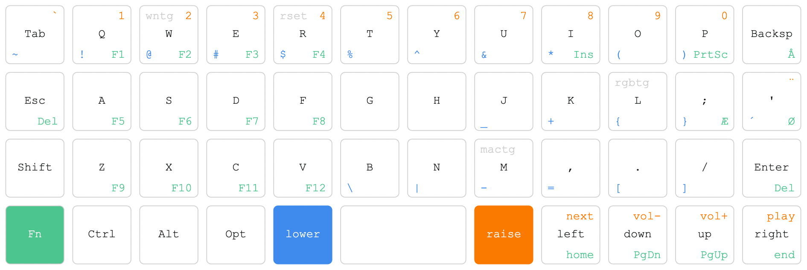

# OrthoKeymapSVG
A simple script to generate a keymap of you Planck/Preonic/Ortho keyboard
It's created in Python, so you'll need that on your system to run the script.

- Download the script [CreateOrthoKeybSVG.py](CreateOrthoKeybSVG.py)
- Edit the script to match your keyboard
- Run script with redirect to a .svg file: `CreateOrthoKeybSVG.py > MyKeymap.svg`
- Edit the .svg file to match your layout - replace the random legends with you own (with a text editor of your choice)
- Open the .svg file in your browser and print it or convert it to png/jpg/whatever
    
    
    
## This is a sample layout matching my own Planck keymap

