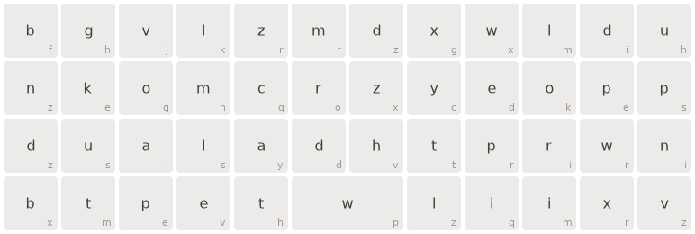

# OrthoKeymapSVG

A script to generate a keymap for your Planck/Preonic/ortho/split ortho keyboard.
~~It's created in Python, so you'll need that on your system to run the script.~~
The new version is created in PowerShell so you'll need that on your system - see the following guide on [how to install PowerShell](https://docs.microsoft.com/en-us/powershell/scripting/install/installing-powershell?view=powershell-7.2).

_The old Python version is not maintained any more, but still available [OldCreateOrthoKeymapSVG.py](OldCreateOrthoKeymapSVG.py)_

## Download the script

Download the script [CreateOrthoKeymapSVG.ps1](CreateOrthoKeymapSVG.ps1) to your computer. On windows you might need to set execution policy to run the script (use `Set-ExecutionPolicy`).

## Supported layouts

You need to specify a layout when you run the script. The script has some predefined layouts and custom settings.

    -ortho4x12_MIT
    -ortho4x12_GRID
    -ortho5x12_MIT
    -ortho5x12_GRID
    -ortho_CUSTOM
    -split3x5_3xThumb
    -split3x5_2xThumb
    -split3x6_3xThumb
    -split_CUSTOM

`-Layout` is mandatory parameter but with the `*_CUSTOM` layouts you also need to specify number of rows and columns with `-NumRows` and `-NumColumns` parameters. And with `split_CUSTOM` layout you need to specify `-NumThumbKeysEachSide`.

NOTE: When specifying rows and columns on a split you just enter the numbers for one half.

## Text labels on keycaps

The default output prints random characters at the center of the keycaps. You can also add text to the four corners of the keycaps (see sample output). The random characters are just placeholders - so you need to edit the output file to match your layout.

You can add the extra text labels by adding one or more of the `PrintText` parameters:

    -PrintTextTopLeft
    -PrintTextTopRight
    -PrintTextBottomLeft
    -PrintTextBottomRight
    -PrintTextCenter

## Misc

If you create a custom ortho layout you can select MIT layout (2u spacebar) with the parameter `-MITLayout`.

There is defined a `hold` class in the css for the svg. It can be used to indicate a key beeing held down to activate a layer - just set `class="hold"` on the `<rect>` for the hold key (see sample output).

You can create one keymap with multiple text labels (center and all four corners) or you can create multiple keymaps - one for each layer. Use the `-NumberOfKeyMaps` parameter to specify number of keymaps in the output file.

The default output is a scaleable svg, but you can also get a fixed size output by specifying `-FixedSize` - see sample output.

## Edit to match your own keymap

After you created the keymap svg template you need to edit the svg file to match your own layout. You can also change the styles (font, colors, size, etc.). The default is light grey for the secondary text labels - but feel free to add a little color like I have done on my Planck keymap.

## Sample output

### A Planck (4x12) MIT layout:

    ./CreateOrthoKeymapSVG.ps1 -Layout ortho4x12_MIT -PrintTextBottomRight -FileName keymap_ortho4x12.svg

### Create a split 3x5 with 6 thumb keys and 2 keymaps:

    ./CreateOrthoKeymapSVG.ps1 -Layout split3x5_3xThumb -NumberOfKeyMaps 2 -FileName keymap_split3x5.svg

### My own Planck keyboard MIT layout - changed the styles a bit:

### My own Boardsource Microdox keymap - this has a fixed size:

